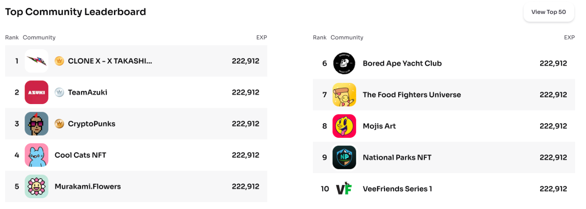

# Frame One Software Take Home

## Overview

Welcome to the Frame One Software Take Home Project! This repository serves as a platform to assess your skills in full-stack development. We've designed it to closely mimic the kind of work you'd encounter at Frame One Software. The user stories you'll tackle are adapted from real scenarios we've dealt with, offering you a glimpse into our day-to-day challenges.

## Your Task

You are required to complete two user stories provided in this repository. These stories are designed to test your ability to understand, interpret, and implement solutions based on typical requirements you'd face in our team. Below is an explanation of a real feature we have built and two user stories that accurately resemble a real task that would be assigned to a developer at Frame One Software.

### Editting Guidelines

During the completion of this take home project, feel free to edit the project in any way you see fit. You do not have to use the APIs set up for you. You can change the models in any way you like, and you are allowed to add new libraries to the project. The only static things are you must use MongoDB, Express, React, Nodejs, and Typescript. The rest is up to you.


### Introduction to Communities and Leaderboards
A leaderboard is an exciting feature we have developed for one of our top clients at Frame One Software that showcases the top-performing communities on their platform. It's more than just a list; it's a dynamic representation of community engagement and accomplishment. Here's how it works:

**Point Accumulation:** Every user earns points through various activities and contributions within their community. These activities could range from posting content to engaging in discussions, each adding to their point tally.

**Community Performance:** The collective performance of a community is determined by the sum of points accumulated by all its members. This aggregation reflects the overall activity and engagement level of the community.

**Competitive Edge:** The leaderboard ignites a competitive spirit, encouraging users to actively participate and contribute to their communities. It's not just about individual glory; it's about rallying together to lift your community to the top.

**Engagement and Motivation:** By displaying the top communities, the leaderboard fosters a sense of achievement and motivation. It's a visual testament to the power of community effort and engagement.

**Technical Insights:** For an in-depth understanding of how users and communities are structured and how points are tracked, delve into User.ts and Community.ts in our backend codebase.

This leaderboard isn't just a feature; it's a catalyst for community growth and engagement. It's about celebrating the collective efforts and achievements of vibrant communities. We have simplified this leaderboard feature for this take home assignment.

For inspiration, here's an example of a real leaderboard we've built before:



### User Story #1: Implement User Ability to Join and Leave Communities

As a user, I want to have the capability to join and leave communities. I should be able to view a list of available communities and make a choice to either join or leave them. The system should enforce that I can only be a part of one community at a time.

#### Acceptance Criteria
- [ ] Users must only be allowed to be a part of one community at a time. Attempting to join another community while already a member of one should either automatically leave the current community or prompt an error message.
- [ ] Users can join a community by triggering the `/:userId/join/:communityId` endpoint.
- [ ] Users can leave a community by triggering the `/:userId/leave/:communityId` endpoint.

#### Notes
For this user story, do not worry about making any UI. UI is already created and hooked up to the APIs in `/backend/src/routes/user.ts`. You will simply just need to implement the `/:userId/join/:communityId` and `/:userId/leave/:communityId` APIs, while editting/creating models in `/backend/src/models`.

### User Story #2: Implement Leaderboard for Communities Based on Collective Points
As a user, I want to view a leaderboard of all the communities, ranked based on the collective experience points of their members. The leaderboard should display the community's logo, name, rank, total experience points, and the number of users in each community.

#### Acceptance Criteria
- [ ] Communities should be ranked in the leaderboard based on the total collective experience points of their members.
- [ ] Each community's entry in the leaderboard should include:
  - [ ] Community logo
  - [ ] Community name
  - [ ] Placing (rank) in the leaderboard
  - [ ] Total number of collective experience points
  - [ ] Number of users in the community
- [ ] The leaderboard should be visually appealing and user-friendly on the frontend. (Please refer to the picture above, this would be considered an acceptional example for the sake of this test)

### Notes
Unlike the previous user story, no APIs or files were prepared for you. Feel free to complete this task in any way you see fit. Also there are no restrictions on libraries or third party tools. Feel free to use whatever technologies or external packages you like to complete this user story. Feel free to just place the leaderboard underneath the existing UI.

## Submission Guidelines

After completing the user stories, you have two options for submission:

1. **GitHub Submission:**
    - Push your solution to a GitHub repository.
    - Ensure the repository is public or accessible to us.
    - Provide the repository link via email.

2. **Email Submission:**
    - Zip the entire project folder.
    - Send the zipped file back as an attachment in your response email.

## Interview Stage

Should you advance to the next stage, you'll be invited for a live coding interview. This session will be conducted over Google Meet, where you'll be asked to share your screen and work through a new user story in your repository. This live coding challenge is designed to evaluate your coding and problem-solving skills in a real-time setting.

### Prepare Your Computer for Screen Sharing
If you have never shared your screen before via Google Meet, we suggest going to https://meet.google.com/, and after signing in to a Google Account, start a new Meeting and try sharing your screen. On operating systems like MacOS, there might be permissions that need to be enabled on your browser for this to work. For more information, you can refer to this Google support article: https://apps.google.com/supportwidget/articlehome?hl=en&article_url=https%3A%2F%2Fsupport.google.com%2Fmeet%2Fanswer%2F9308856%3Fhl%3Den&assistant_id=hangouts-meet-v2&product_context=9308856&product_name=UnuFlow&trigger_context=meet

# Repository Documentation

## Project Initialization

This project requires Node.js version 20.0.0 or higher. If you already have Node.js installed and need to upgrade, we recommend using Node Version Manager (NVM). You can find NVM at this link: https://github.com/nvm-sh/nvm. However, using NVM is optional.

To check your Node.js version, run the following command in your terminal:

```
node --version
```

This project uses PNPM instead of NPM. If you don't have PNPM installed, you can install it by running the following command:

```
npm install -g pnpm
```

Once you have the correct Node.js version and PNPM installed, navigate to the root of the project directory and install the project dependencies by running:

```
pnpm install
```

After the installation is complete, you can initialize the project. The project has universal run scripts, but the frontend and backend can be run separately as well. Here are the commands you can use:

To run the entire project:

```
pnpm dev
```

To run only the backend:

```
pnpm dev:backend
```

To run only the frontend:

```
pnpm dev:frontend
```

## Setting Up MongoDB with Docker

This section guides you through the process of setting up MongoDB locally using Docker. Docker simplifies the management of MongoDB, ensuring a consistent and isolated environment for your database.

### Prerequisites
- **Docker Installation:** Ensure Docker is installed on your machine. If not, download and install Docker Desktop from [Docker's official website](https://www.docker.com/products/docker-desktop).

### Steps to Run MongoDB

1. **Pull MongoDB Image:** Use the command below to pull the latest MongoDB image from Docker Hub:

   ```
   docker pull mongo
   ```
   This step downloads the official MongoDB image to your machine.

2. **Start MongoDB Container:** Run the MongoDB container with the following command:
   ```
   docker run -d -p 27017-27019:27017-27019 --name mongodb mongo
   ```
   This command initiates a MongoDB container named `mongodb`, and maps the ports `27017` to `27019` from the container to the host, making the database accessible on these ports.

3. **Accessing MongoDB:** The MongoDB instance is now running on `localhost` on port `27017`. You can connect to it using any MongoDB client or via the command line.

### Stopping the MongoDB Container

To stop the running MongoDB container, execute:
```
docker stop mongodb
```
This command halts the 'mongodb' container, effectively stopping the MongoDB instance.


### Connecting to MongoDB Using Mongo Compass

Mongo Compass is a GUI client for MongoDB. To connect your MongoDB instance with Mongo Compass:

1. **Install Mongo Compass:**
Download and install Mongo Compass from [MongoDB's official page](https://www.mongodb.com/products/tools/compass).

2. **Launch and Connect:**
   - Open Mongo Compass.
   - In the connection string field, enter: `mongodb://localhost:27017`.
   - Click "Connect" to establish a connection with your local MongoDB instance.

You should now be successfully connected to your MongoDB instance via Mongo Compass.

## Generating Data

After connecting to MongoDB and running the backend, you can generate dummy data to work with by using the following endpoints. Simply type these URLs into your browser to trigger them:

1. **Inflate Database:**
   - Call [`http://localhost:8080/utils/inflate-db`](http://localhost:8080/utils/inflate-db)
   - This endpoint inflates the database with dummy data. It creates 100 users and 10 communities.

2. **Drop Database:**
   - Call [`http://localhost:8080/utils/drop-db`](http://localhost:8080/utils/drop-db)
   - This endpoint deletes all users and communities from the database.


